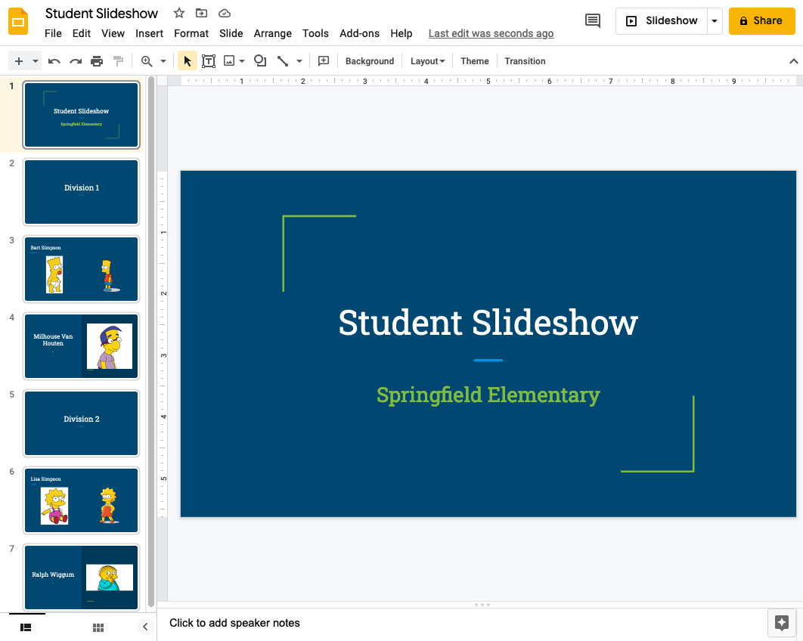

# Slideshow Generator



Generate a Google Slides slideshow based on school pictures and baby photos.

This leans heavily on the [md2gslides](https://github.com/googleworkspace/md2googleslides) program, which generates Google Slides from a markdown file.

## Installation

### Prerequisite: install `md2gslides`

The [installation instructions](https://github.com/googleworkspace/md2googleslides#installation-and-usage) for `md2gslides` are mostly right, but instead of running `npm install -g md2gslides`, you need to run this:
```
$ npm install -g googleworkspace/md2googleslides
```

The reason is that there's a [bug](https://github.com/googleworkspace/md2googleslides/issues/95#issuecomment-1004022204) that's been fixed, but not officially released yet.

The rest of the installation instructions from `md2gslides` should work. "Computer Application" is now labelled "Desktop App" in the Google Cloud Platform's `Application Type` drop-down when creating the OAuth client ID.

### Get the code and install dependencies

Clone this repo:
```
$ git clone https://github.com/alouie-sfdc/nrp-slides
```

Install the Python dependencies:
```
$ pip install -r requirements.txt
```

Create your `.env` file to store your settings:
```
$ cp env.template .env
```
You can customize your settings by modifying the `.env` file.

## Generate a sample slide deck

To confirm that things work, this will generate an initial set of slides:
```
$ python generate-slides.py
```

If you want to make changes and continue using that slide deck, get the ID of the slide deck (which is contained in the URL) and pass it as a parameter. For example, if your slides are at:
```
https://docs.google.com/presentation/d/1VXyAXRXR168tM5xlNB2BoL5pK8IPAwMDu-6PoPan2Ag/edit
```
Then use this command to re-generate the slides at that URL:
```
$ python generate-slides.py -i 1VXyAXRXR168tM5xlNB2BoL5pK8IPAwMDu-6PoPan2Ag
```

You can also update the local markdown file without updating the slides:
```
$ python generate-slides.py --markdown-only
```

## Making your own slide deck

Follow the example from the `sample-data` directory:
```
├── sample-data
│   ├── baby-photos
│   │   ├── Simpson_Bart.JPG
│   │   └── Simpson_Lisa.JPG
│   ├── divisions
│   │   ├── 1.csv
│   │   └── 2.csv
│   ├── school-photos
│   │   ├── Simpson_Bart.JPG
│   │   ├── Simpson_Lisa.JPG
│   │   ├── Van_Houten_Milhouse.JPG
│   │   └── Wiggum_Ralph.JPG
│   └── student_list.csv
```
**Note**: image filenames aren't allowed to have spaces in them.

All students are expected to have a photo in the `school-photos` directory. They can also have a photo in the `baby-photos` directory, but it's not required.

The `student_list.csv` file is a three-column comma-separated value file, with the three columns being last name, first name, and image filename:
```
Simpson, Bart, Simpson_Bart.JPG
Van Houten, Milhouse, Van_Houten_Milhouse.JPG
Simpson, Lisa, Simpson_Lisa.JPG
Wiggum, Ralph, Wiggum_Ralph.JPG
```

Students are grouped into divisions in the `divisions` directory, with each division having its own file called `<division name>.csv`. An example is `1.csv`, containing the last name and first name of the students in division 1:
```
Simpson, Bart
Van Houten, Milhouse
```

Your slides will be generated based on what's in the CSV and image files.

### Hosting photos externally

By default, `md2gslides` uses the file.io service to temporarily host photos. It's a free service that works well for a few photos, but if you have more photos, you'll likely run into problems because of the file upload limits for the free plan.

A better solution is to temporarily host the photos yourself. You can do this rather easily with Heroku by following the instructions for [deploying a static site](https://gist.github.com/wh1tney/2ad13aa5fbdd83f6a489).
